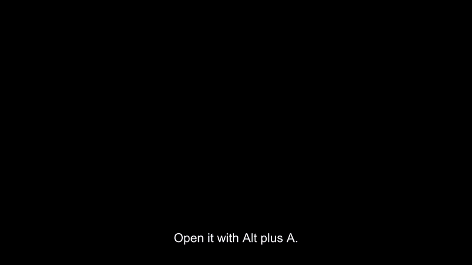
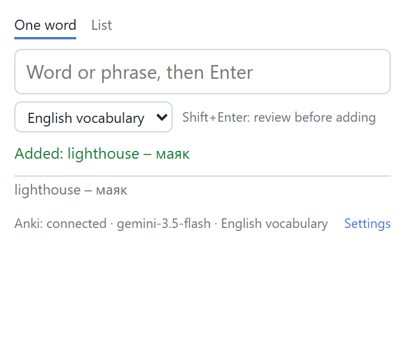
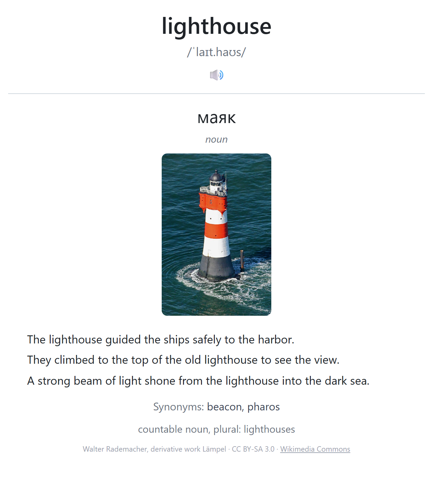
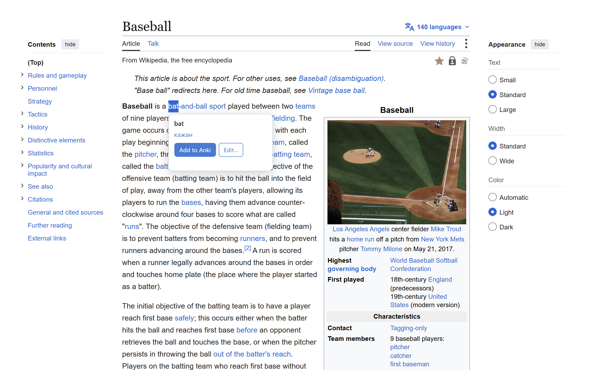
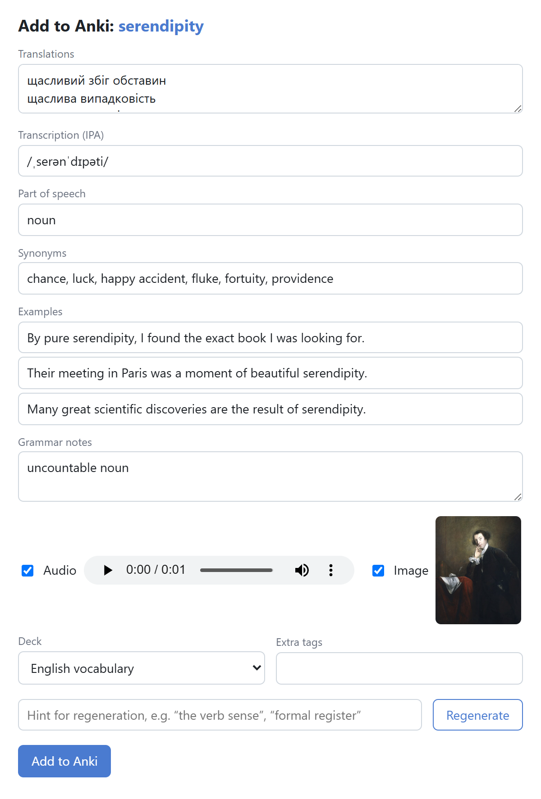
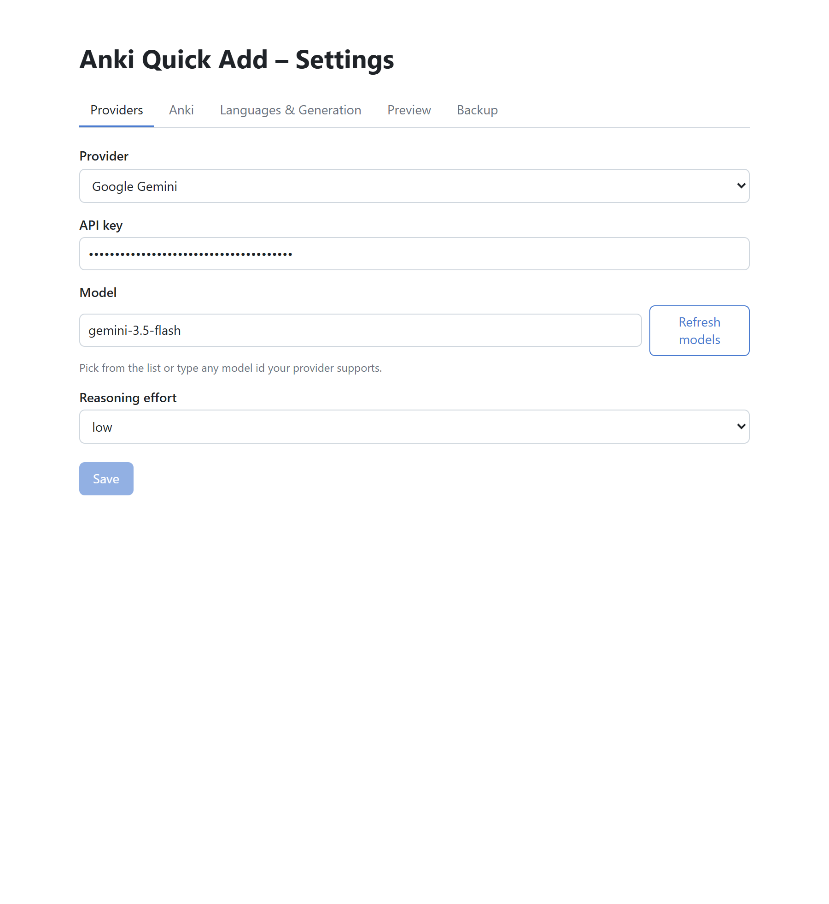
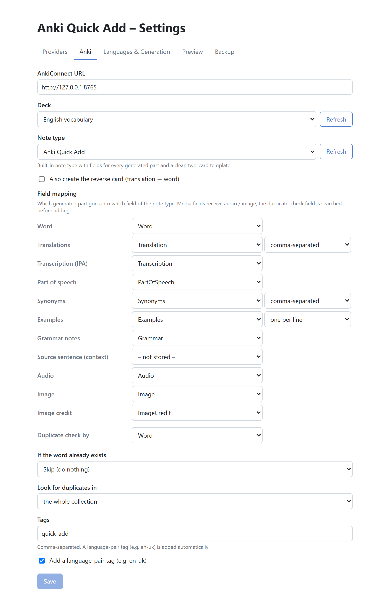
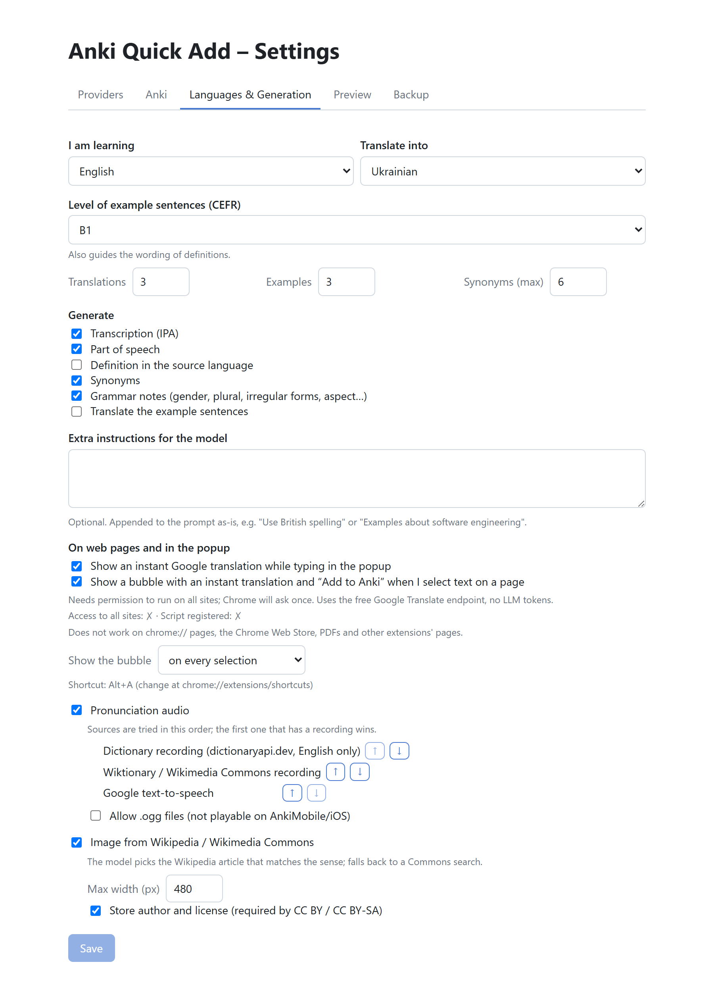
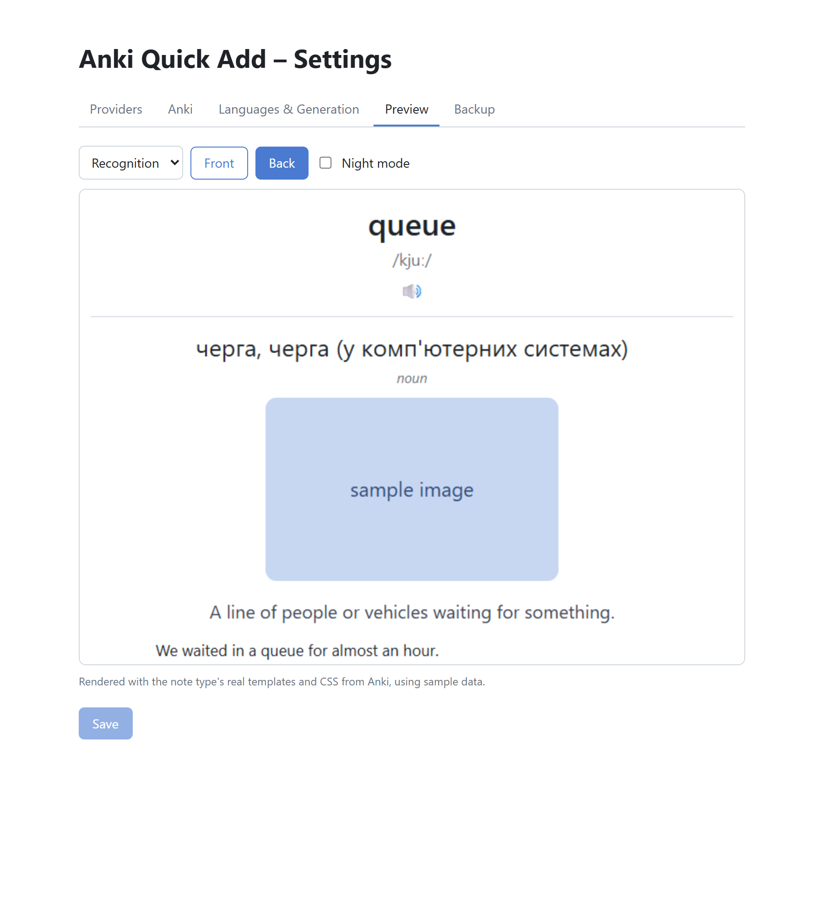
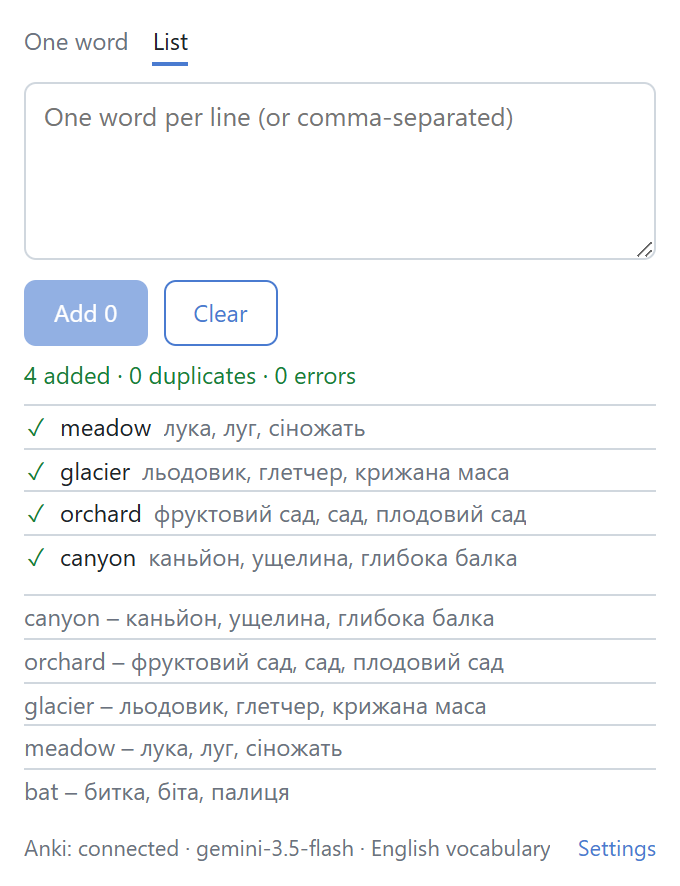

<div align="center">

# 🃏 Anki Quick Add

### One word in. A complete Anki card out.

Type a word, or select it on any page, and a finished flashcard lands in Anki: translation,
transcription, part of speech, example sentences, synonyms, grammar notes, pronunciation audio and
a Wikipedia image with its license. The content comes from the LLM provider **you** choose with
**your** key; the note goes into Anki through AnkiConnect. Nothing in between.

[](https://github.com/sergiyclas/anki-quick-add/actions/workflows/ci.yml)
[](LICENSE)

</div>

---

<div align="center">

## 🛠 Tech Stack

**Extension**<br>


**LLM providers**<br>


**Anki & media**<br>


**Quality**<br>


</div>

---

## 🎬 Demo

<div align="center">



*A word typed into the popup, the instant translation while typing, and the card the extension made:
translation, IPA, three examples, synonyms, a grammar note and a Wikipedia photo with its credit.*

**[▶ Watch the feature tour](docs/demo.mp4)** – 1:45, every feature in order

</div>

Nothing in the recording is staged. The cards are what Gemini 3.5 Flash generated on that run, the
media came from Wikipedia and dictionaryapi.dev, and the notes were written to a real Anki collection
through AnkiConnect. The whole capture is reproducible with `npx tsx scripts/capture.ts`.

<details>
<summary><b>Every screen, and what it shows</b></summary>

<br>

**Popup after adding a word** – the status line, the word in the history, and the footer with the
Anki connection, the model and the target deck.



**The card, as Anki renders it** – the built-in note type's back side: translation, part of speech,
image, examples, synonyms, grammar note and image credit.



**Selection bubble** – Shift + select on a Wikipedia page. The instant Google translation says
*кажан* (the animal); one click later the card says *битка* (the baseball bat), because the sentence
travelled along as context.



**Editor** – Shift+Enter (or *Edit…* in the bubble) opens the generated card before it is added: every
field editable, audio and image can be dropped, *Regenerate* takes a hint.



**Providers** – one key per provider, model list fetched from the provider, reasoning effort.



**Field mapping** – which generated part goes into which field of the note type, the duplicate-check
field, list formats, duplicate policy.



**Languages & generation** – source and target language, CEFR level, counts, what to generate,
audio source order, image settings.



**Preview** – the note type's real templates and CSS from Anki, rendered with sample data.



**List mode** – a pasted list, added one by one, with a summary.



</details>

---

## 🚀 Quick Start

### Requirements

- Chrome 144+ (or any current Chromium browser)
- [Anki](https://apps.ankiweb.net/) desktop running with the [AnkiConnect](https://ankiweb.net/shared/info/2055492159) add-on (code `2055492159`) – no AnkiConnect configuration needed
- An API key for one LLM provider, or a local model behind Ollama / LM Studio

### Install

*Chrome Web Store listing: coming soon.* Until then, build it yourself:

```bash
git clone https://github.com/sergiyclas/anki-quick-add.git
cd anki-quick-add
npm install
npm run build          # -> dist/
```

`chrome://extensions` → **Developer mode** → **Load unpacked** → select `dist/`.

### First run

1. Click the icon → **Settings** → **Providers**: pick a provider, paste the key, choose a model.
2. **Anki**: choose the deck. Keep the built-in note type (created on first use) or pick one of yours
   and map the fields.
3. **Languages & Generation**: set the language you learn and the language you translate into.
4. Press **Alt+A** anywhere, type a word, press **Enter**.

---

## ✨ Features

### 🧠 A whole card from one word

The provider gets a JSON schema built from your settings and returns exactly the parts you asked
for: translations, IPA, part of speech, definition, synonyms, example sentences at a chosen CEFR
level (optionally translated), and a grammar note that adapts to the language – gender and plural
for German, aspect pairs for Slavic languages, irregular forms for English. Ukrainian targets get
built-in rules against calques from Russian.

### 🔌 Your provider, your key

Anthropic, OpenAI (Responses API), Google Gemini, or any OpenAI-compatible endpoint with presets
for OpenRouter, Groq, DeepSeek, xAI, Mistral, Ollama and LM Studio. Every adapter asks for strict
JSON output and falls back to plain JSON mode when a server does not support it. Keys live in your
browser and go only to the provider they belong to.

### 🃏 Any note type

A built-in note type with fields for every generated part and a two-card template (the reverse card
is optional per note), or a mapping table that puts the generated parts into the fields of the note
type you already use. The preview tab renders your note type's real templates and CSS.

### 🖼 Media that fits the sense

Pronunciation from dictionaryapi.dev or Wiktionary recordings, Google TTS as fallback, `.ogg` off
by default because AnkiMobile cannot play it. The image is the lead image of the Wikipedia article
the model picked for the intended sense, with a Commons search as fallback, and the author and
license stored on the note.

### ⚡ Fast when you want it, careful when you need it

An instant Google translation appears while you type, before any LLM call. On web pages, Shift +
select shows a bubble with the translation and an *Add to Anki* button; the sentence around the word
goes along as context. Shift+Enter opens an editor to review, edit or regenerate with a hint. List
mode adds a pasted list one word at a time and reports added / duplicates / errors.

### 🔁 Duplicates, sync, backup

Duplicates are checked in the collection or the target deck before anything is generated; policy:
skip, add anyway, or fill the empty fields of the existing note. Settings and mappings sync through
Chrome Sync (keys optional), and a JSON export/import moves them anywhere else.

---

## 🏗 Architecture

```
popup / editor / options / content script (bubble)
        │  chrome.runtime messages
        ▼
service worker (background)
  normalizeWord ─► dedupe (AnkiConnect findNotes) ─► generate (provider adapter, JSON schema)
                                                   ║ in parallel: audio (dictionary → Wiktionary → TTS)
                                                   ▼
                          image (Wikipedia lead image for the model's imageQuery → Commons search)
                                                   ▼
                          buildNote (field mapping, list formats, media attachments)
                                                   ▼
                          AnkiConnect addNote / updateNoteFields
```

All network traffic – AnkiConnect, providers, media – goes through the service worker, so host
permissions, retries and diagnostics live in one place. The pipeline is split into `prepare()` (steps
up to the built note) and `commit()` (the write), which is what lets the editor window show a card
before it exists in Anki.

### Project layout

```
src/
  background/   service worker: message router, context menu, editor jobs, bubble registration, toast
  content/      selection bubble (self-contained, injected only when enabled)
  lib/
    anki/       AnkiConnect client, built-in note type, search helpers
    providers/  anthropic, openai, gemini, openaiCompat + presets and catalog
    generation/ JSON schema builder, prompt builder, validator, per-language quality rules
    media/      dictionaryapi, Wiktionary audio, Google TTS, Wikipedia/Commons images
    note/       field mapping, renderers, note builder, template preview (mini mustache)
    pipeline/   prepare / commit / batch
    settings/   schema, storage layout, export/import, host permissions
  popup/ options/ editor/ ui/   Preact pages
public/         manifest, icons, _locales (12 languages)
tests/          unit tests (vitest) + opt-in live integration tests
scripts/        e2e (Playwright on the built extension), capture, store assets, icons, zip
```

---

## ⚙️ Configuration

Everything is set in the options page; this is what the settings mean.

| Setting | Options | Default |
|---|---|---|
| Provider / model | Anthropic, OpenAI, Gemini, OpenAI-compatible; any model id | Anthropic · `claude-sonnet-5` |
| Reasoning effort | low / medium / high | low |
| Languages | ~40, any source → target pair | English → Ukrainian |
| Generate | transcription, part of speech, definition, synonyms, grammar, example translations | all but definition and example translations |
| Counts | translations 1–5, examples 0–6, synonyms 1–10 | 3 / 3 / 6 |
| Examples level | CEFR A1–C2 | B1 |
| Audio | source order dictionary → Wiktionary → TTS; allow `.ogg` | on, `.ogg` off |
| Image | Wikipedia lead image → Commons search; max width; store credit | on, 480 px, credit on |
| Note type | built-in `Anki Quick Add`, or any note type with a field mapping | built-in |
| Duplicates | skip / add / update; search the collection or the deck | skip, collection |
| Tags | free tags + automatic language-pair tag | `quick-add`, `en-uk` |
| Selection bubble | off / on; trigger: Shift, Alt or every selection | off; Shift |
| Shortcut | `chrome://extensions/shortcuts` | Alt+A |

---

## 🧪 Testing

```bash
npm run check                                   # tsc + 62 unit tests + build + dist checks
npm run e2e                                     # Playwright drives the built extension (Anki running)
AQA_ANKI=1 npx vitest run tests/integration/anki.test.ts     # live AnkiConnect
AQA_NET=1  npx vitest run tests/integration/media.test.ts    # live Wikipedia / Wiktionary / TTS
AQA_LIVE=1 npx vitest run tests/integration/providers.test.ts # live providers (keys from env)
```

The e2e run loads `dist/` into a headless Chromium, checks the popup, every options tab, the field
mapping, the preview, batch mode and the selection bubble on a real Wikipedia page.

---

## 🔒 Privacy

The words you add, and the sentence around them when you use the bubble or the context menu, are
sent to the provider you configured and to the public media APIs. No server of this project exists
and nothing is collected. Details in [PRIVACY.md](PRIVACY.md).

---

## 📄 License

[MIT](LICENSE)
